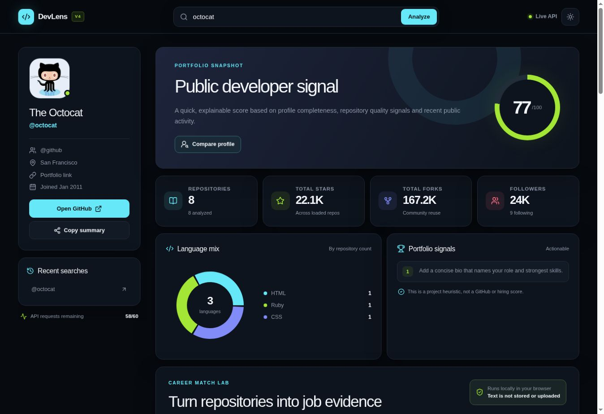

# DevLens — GitHub Profile & Portfolio Analyzer


DevLens is a responsive GitHub profile and portfolio analyzer. It analyzes public repositories, matches resume and job-description skills, calculates repository-quality scores, recommends suitable projects, and provides improvement suggestions.

## Live Demo

[Open DevLens Live](https://devlens-himanshu.palhimanshu0192.workers.dev)

## Project Screenshot



## Problem Statement

Developers often list many skills on their resumes, but recruiters may not find enough evidence of those skills in their GitHub repositories.

Manually checking repositories, README files, technologies, activity, and missing skills takes time. DevLens solves this problem by converting public GitHub data into understandable scores, skill matches, project recommendations, and improvement plans.

## Key Features

- Analyzes public GitHub profiles and repositories.
- Generates an explainable portfolio score out of 100.
- Matches resume skills with GitHub repository evidence.
- Supports PDF, DOCX, TXT and Markdown resume files.
- Matches job-description requirements with GitHub skills.
- Detects matched, missing and unproven technical skills.
- Recommends a suitable project according to the job description.
- Provides project stack, screens, APIs, database model and build steps.
- Generates individual repository-quality scores.
- Analyzes public repository README files.
- Creates a skill evidence map from repository signals.
- Compares two GitHub profiles.
- Shows profile and repository improvement suggestions.
- Estimates how improvements can increase the portfolio score.
- Supports repository search, filtering and sorting.
- Provides dark and light themes.
- Works on desktop, tablet and mobile devices.
- Uses public GitHub data without requiring login.

## Tech Stack

| Category | Technologies |
| --- | --- |
| Frontend | React.js, JavaScript and JSX |
| Structure | Semantic HTML through JSX |
| Styling | CSS3 and responsive layouts |
| API | GitHub REST API |
| Components | Reusable UI components |
| Icons | Lucide React |
| Resume Processing | PDF.js and Mammoth |
| Build Tools | Vite and Vinext |
| Deployment | Cloudflare Workers |
| Version Control | Git and GitHub |

## How DevLens Works

1. The user enters a public GitHub username.
2. DevLens fetches profile and repository data from the GitHub REST API.
3. It calculates profile and repository-quality signals.
4. Repository languages, topics, names and descriptions are analyzed.
5. The application creates a GitHub skill inventory.
6. Resume or job-description skills are compared with repository evidence.
7. Missing skills and portfolio gaps are identified.
8. A suitable project and improvement roadmap are generated.

## Resume Evidence Matching

Users can upload or paste their resume content. DevLens compares detected resume skills with visible evidence available in public GitHub repositories.

Supported resume formats:

- PDF
- DOCX
- TXT
- Markdown

Maximum supported file size: **8 MB**

Resume files are processed locally inside the browser and are not permanently uploaded or stored.

## Job-Description Matching

Users can paste a job description to receive:

- Overall job match percentage
- Matched skills
- Missing skills
- Skills without visible GitHub evidence
- Suitable portfolio project recommendation
- Recommended technology stack
- Core application screens
- REST API plan
- Suggested database model
- Step-by-step project-building plan
- Resume-ready project outcome

## Repository Quality Score

Repository-quality scores use public metadata such as:

- Repository description
- Primary programming language
- Repository topics
- Recent activity
- Homepage or live demo
- Stars and forks
- Issue support
- Archived status

These scores are project-based heuristics and are not official GitHub or hiring scores.

## GitHub API Endpoints

DevLens uses public GitHub REST API endpoints:

```text
GET https://api.github.com/users/{username}

GET https://api.github.com/users/{username}/repos

GET https://api.github.com/repos/{owner}/{repository}/readme
```

No API key is required for normal public-profile analysis. GitHub can apply a request limit to unauthenticated API usage.

## Getting Started

### Prerequisites

- Node.js 22 or later
- npm
- Git

### Installation

```bash
git clone YOUR_GITHUB_REPOSITORY_URL
cd DevLens
npm install
```

### Run Locally

```bash
npm run dev
```

Open the local URL displayed in the terminal:

```text
http://localhost:5173
```

You can use `octocat` as a sample GitHub username.

## Cloudflare Deployment

Login to Cloudflare:

```bash
npx wrangler login
```

Check login:

```bash
npx wrangler whoami
```

Deploy the project:

```bash
npx @vinext/cloudflare deploy
```

Cloudflare will display the final `workers.dev` demo URL after successful deployment.

## Project Structure

```text
DevLens/
├── app/
│   ├── devlens-client.jsx
│   ├── globals.css
│   ├── layout.tsx
│   └── page.tsx
├── components/
│   └── ui/
├── lib/
│   └── utils.ts
├── public/
├── devlens-dashboard.jpg
├── package.json
├── vite.config.ts
├── wrangler.jsonc
└── README.md
```

## Project Roadmap

| Phase | Development Work | Status |
| --- | --- | --- |
| Phase 1 | GitHub profile fetching and repository analysis | ✅ Completed |
| Phase 2 | Portfolio score and language insights | ✅ Completed |
| Phase 3 | Resume evidence matching and file processing | ✅ Completed |
| Phase 4 | Job-description matching and project recommendation | ✅ Completed |
| Phase 5 | Repository scoring and advanced README analyzer | ✅ Completed |
| Phase 6 | Profile comparison and improvement roadmap | ✅ Completed |
| Phase 7 | GitHub OAuth, backend proxy and saved reports | 🔜 Planned |
| Phase 8 | AI README assistant and downloadable PDF reports | 💡 Future |

## Next Development Priorities

1. Add a secure backend proxy for GitHub API requests.
2. Add GitHub OAuth for improved API request limits.
3. Save previous profile and job-match reports.
4. Export analysis results as a professional PDF.
5. Add contribution and commit-quality insights.
6. Compare multiple job descriptions.
7. Add automated testing and GitHub Actions deployment.

## Privacy

- Only public GitHub profile and repository data is analyzed.
- GitHub login is not required.
- Resume files are processed locally in the browser.
- Resume content is not permanently stored or uploaded.

## Author

**Himanshu Pal**  
B.Tech CSE (AI) Student

---

If you find DevLens useful, consider giving the repository a star.
